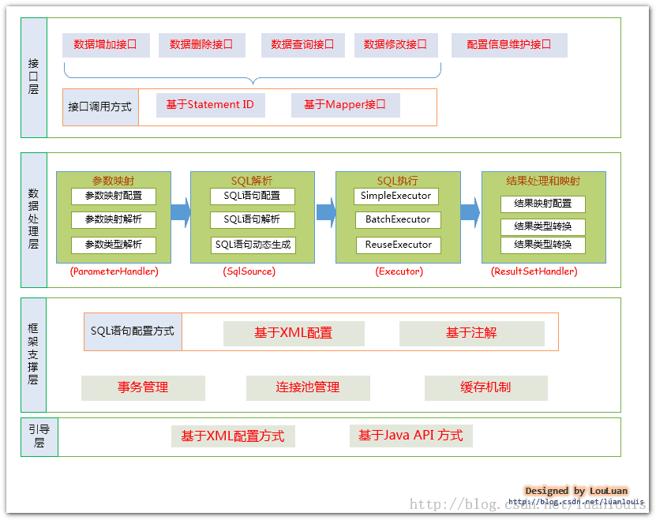

# 什么是MyBatis

MyBatis 是一个持久层框架，简化了 SQL 操作。它**不完全是 ORM（对象关系映射）**，但可以将 SQL 语句与 Java 对象绑定，方便开发者直接编写和管理 SQL，同时支持动态 SQL 和灵活的查询映射。

## MyBatis架构



### **接口层**

接口层负责和数据库交互，有两种方式。

**使用MyBatis提供的API**

这是传统的传递Statement Id 和查询参数给 SqlSession 对象，使用 SqlSession对象完成和数据库的交互；MyBatis 提供了非常方便和简单的API，供用户实现对数据库的增删改查数据操作，以及对数据库连接信息和MyBatis 自身配置信息的维护操作。**这种方式固然很简单和实用，但是它不符合面向对象语言的概念和面向接口编程的编程习惯。**

**使用Mapper接口**

MyBatis 将配置文件中的每一个`<mapper>` 节点抽象为一个 Mapper 接口，而这个接口中声明的方法和跟`<mapper>` 节点中的`<select|update|delete|insert>` 节点项对应，即`<select|update|delete|insert>` 节点的id值为Mapper 接口中的方法名称，parameterType 值表示Mapper 对应方法的入参类型，而resultMap 值则对应了Mapper 接口表示的返回值类型或者返回结果集的元素类型。

根据MyBatis的配置规范配置好后，通过SqlSession.getMapper(XXXMapper.class)方法，MyBatis 会根据相应的接口声明的方法信息，通过**动态代理机制生成一个Mapper实例**，我们使用Mapper接口的某一个方法时，MyBatis会根据这个方法的方法名和参数类型，确定Statement Id，底层还是通过SqlSession.select("statementId",parameterObject);或者SqlSession.update("statementId",parameterObject); 等等来实现对数据库的操作， MyBatis 引用Mapper 接口这种调用方式，纯粹是**为了满足面向接口编程的需要**。（其实还有一个原因是在于，面向接口的编程，使得用户在接口上可以使用注解来配置SQL语句，这样就可以脱离XML配置文件，实现“0配置”）。

### **数据处理层**

- 通过传入参数构建动态SQL
- SQL语句的执行以及封装查询结果集成`List<E>`

**参数映射和动态SQL语句生成**

动态语句生成可以说是MyBatis框架非常优雅的一个设计，MyBatis 通过传入的参数值，使用 Ognl 来动态地构造SQL语句，使得MyBatis 有很强的灵活性和扩展性。

参数映射指的是对于java 数据类型和jdbc数据类型之间的转换：这里有包括两个过程：查询阶段，我们要将java类型的数据，转换成jdbc类型的数据，通过 preparedStatement.setXXX() 来设值；另一个就是对resultset查询结果集的jdbcType 数据转换成java 数据类型。

**SQL语句的执行以及封装查询结果集成List**

动态SQL语句生成之后，MyBatis 将执行SQL语句，并将可能返回的结果集转换成`List<E>` 列表。MyBatis 在对结果集的处理中，支持结果集关系一对多和多对一的转换，并且有两种支持方式，一种为嵌套查询语句的查询，还有一种是嵌套结果集的查询。

### **框架支撑层**

- 事务管理机制
- 连接池管理机制
- 缓存机制
- SQL语句配置方式

### **引导层**

引导层是配置和启动MyBatis配置信息的方式。MyBatis提供两种方式来引导MyBatis：基于XML配置文件的方式和基于Java API的方式。

# MyBatis优缺点

**优点**：

1. **灵活性和控制力**
   - 开发者直接编写SQL，可精细优化复杂查询（如多表关联、动态条件、分页等），适合对性能要求高的场景。
   - 支持动态SQL（`<if>`, `<foreach>` 等标签），灵活应对多条件查询。
   - 适用于遗留数据库或需要与复杂存储过程交互的场景。
2. **轻量级与低侵入性**
   - 无需强制遵循对象-关系映射（ORM）规范，适合对数据库表结构有特殊设计的项目。
   - 与Spring等框架集成简单，配置简洁。
3. **透明化SQL管理**
   - SQL与Java代码解耦，集中管理在XML或注解中，便于维护和DBA协作。
4. **性能优化可控**
   - 避免全自动ORM框架可能生成的冗余SQL（如N+1查询问题），直接控制执行计划。

**缺点**：

1. **手动编写SQL**
   - 开发效率较低，需为每个操作编写SQL，增加代码量。
   - SQL维护成本高，尤其在表结构频繁变更时。
2. **半自动化特性**
   - 需要手动处理对象-关系映射（ResultMap配置），复杂映射场景下配置较繁琐。
   - 不支持自动化缓存机制（需手动集成如Redis等）。
3. **学习曲线**
   - 需熟悉XML配置或注解语法，以及动态SQL标签的使用。

## MyBatis 与其他ORM框架对比

| **框架**            | **类型**    | **核心优势**                                             | **劣势**                                         | **适用场景**                                        |
| :------------------ | :---------- | :------------------------------------------------------- | :----------------------------------------------- | :-------------------------------------------------- |
| **MyBatis**         | 半自动化ORM | SQL完全可控，灵活性高，适合复杂查询和性能优化。          | 需手动编写SQL，开发效率较低。                    | 对SQL有精细化控制需求的业务（如金融、大数据分析）。 |
| **Hibernate**       | 全自动化ORM | 开发效率高，自动化CRUD和缓存，支持HQL面向对象查询。      | 复杂查询优化困难，生成的SQL可能不够高效。        | 快速开发、对象关系映射简单的业务系统。              |
| **Spring Data JPA** | JPA规范实现 | 极简Repository接口，支持派生查询，与Spring生态无缝集成。 | 复杂查询需依赖@Query或Criteria API，灵活性受限。 | 基于Spring的快速开发项目，简单CRUD操作为主。        |

# `#{}`和`${}`有什么区别

1. 处理机制

- `#{}`：采用**预编译(PreparedStatement)**机制，参数会被替换为`?`占位符，通过JDBC的预编译功能对参数进行安全处理，**防止SQL注入**。
- `${}`：采用**字符串替换**机制，直接将参数值拼接到SQL语句中，生成完整的SQL。

2. 安全性

- `#{}`：天然防止SQL注入，适用于传递**参数值**。
- `${}`：存在SQL注入风险，适用于动态拼接**SQL关键字、表名、列名**等非参数值场景。

3. 使用场景

- **`#{}`** 适用场景：

  - WHERE条件中的值：`WHERE id = #{id}`

  - INSERT/UPDATE的字段值：`VALUES(#{name}, #{age})`

  - 模糊查询（需结合函数处理）：

    ```sql
    WHERE name LIKE CONCAT('%', #{keyword}, '%')
    ```

- **`${}`** 适用场景：

  - 动态表名/列名：`SELECT * FROM ${tableName}`
  - 动态排序：`ORDER BY ${column} ${order}`
  - 动态SQL片段（如动态的`GROUP BY`或`HAVING`）

最佳实践

- 优先使用`#{}`，仅在必须动态拼接SQL关键字或结构时使用`${}`，并严格校验参数值。

## 为什么使用`#{}`能防止SQL注入

在MyBatis中使用 `#{}` 能防止SQL注入，主要归功于其底层依赖的 **预编译（PreparedStatement）机制** 和 **参数化查询** 的安全特性。

### 预编译机制

`#{}` 在底层会通过JDBC的 `PreparedStatement` 实现参数替换。具体过程如下：

1. **SQL预解析**：
   数据库会先将SQL语句的骨架（如 `SELECT * FROM user WHERE id = ?`）进行语法分析、编译和优化，生成执行计划。此时，参数部分以占位符 `?` 表示，**SQL结构已经固定**。
2. **参数传递**：
   后续传入的参数值（如 `id = 5` 或 `id = '1 OR 1=1'`）会被严格视为**数据**，而非SQL代码的一部分。
3. **类型安全处理**：
   数据库会根据参数的类型自动进行转义处理（如字符串添加引号、特殊字符转义），确保参数值不会破坏原有SQL结构。

### 参数化查询的安全特性

- **输入值始终为“数据”**：
  即使用户传入恶意参数（如 `id = '1 OR 1=1'`），预编译机制会将其视为一个**完整的字符串值**，而非可执行的SQL片段。
  - 生成的SQL实际为：`SELECT * FROM user WHERE id = '1 OR 1=1'`
  - 由于 `id` 字段的值被正确转义为字符串，无法改变SQL逻辑，查询会直接查找 `id = '1 OR 1=1'` 的记录（通常不存在），而不会返回所有数据。
- **特殊字符自动转义**：
  若参数包含引号、分号等特殊字符（如 `name = "John'; DROP TABLE user; --"`），预编译机制会将其转义为普通字符，避免闭合原有SQL语句或执行额外操作。

## 什么时候必须使用`${}`

在MyBatis中，动态表名、列名等场景必须使用 `${}`，而不能使用 `#{}`，这是因为 **SQL语法结构本身的限制**，而非MyBatis的设计缺陷。但这种场景确实存在SQL注入风险，需要开发者通过**严格的校验机制**来确保安全。

### 为什么动态表名、列名必须用`${}`？

1. **`#{}` 的预编译机制会导致语法错误**

- **`#{}` 会为参数值添加引号**（如字符串类型），而表名、列名是SQL的标识符（Identifier），不能加引号。
  **错误示例**：

  ```sql
  SELECT * FROM #{tableName} WHERE id = 1
  ```

  - 若 `tableName = "user"`，实际生成的SQL为：

    ```sql
    SELECT * FROM 'user' WHERE id = 1  -- 语法错误！
    ```

  - 表名被错误地包裹在引号中，导致SQL执行失败。

- **`${}` 直接替换为字符串**，不会添加引号：

  ```sql
  SELECT * FROM ${tableName} WHERE id = 1
  ```

  - 生成的SQL为：

    ```sql
    SELECT * FROM user WHERE id = 1  -- 语法正确
    ```

2. **SQL语法限制：标识符不能参数化**

- 在标准SQL中，表名、列名、排序关键字（如 `ORDER BY`）等属于**SQL语法结构**，而非参数值。
  这些部分必须在SQL语句的**预编译前确定**，无法通过占位符 `?` 动态绑定。

  - 例如，以下写法在JDBC中不合法：

    ```java
    PreparedStatement ps = connection.prepareStatement("SELECT * FROM ?");
    ps.setString(1, "user");  // 报错：表名不能通过占位符绑定！
    ```

### 使用`${}`，依旧存在SQL注入风险

如果直接使用用户输入的参数作为表名或列名，且未做校验，会导致SQL注入。
**示例攻击**：

```sql
SELECT * FROM ${tableName}
```

- 若 `tableName = "user; DROP TABLE orders; --"`，生成的SQL为：

  ```sql
  SELECT * FROM user; DROP TABLE orders; --  -- 执行后删除orders表！
  ```

虽然必须使用 `${}`，但可以通过以下方法**严格规避风险**：

#### 1. **白名单校验**

- **限制参数值只能从预定义的合法集合中选取**（如固定的表名、列名）。
  **示例代码**：

  ```java
  // 定义合法的表名集合
  private static final Set<String> ALLOWED_TABLES = Set.of("user", "product", "order");
  
  public void queryTable(String tableName) {
      if (!ALLOWED_TABLES.contains(tableName)) {
          throw new IllegalArgumentException("Invalid table name!");
      }
      // 执行SQL：SELECT * FROM ${tableName}
  }
  ```

#### 2. **避免直接使用用户输入**

- 动态表名/列名应来自系统内部逻辑（如根据业务规则生成），而非用户直接输入。
  例如：根据用户类型选择不同的表（`user_vip`、`user_normal`），但表名由代码生成，而非前端传递。

#### 3. **转义标识符（部分数据库支持）**

- 某些数据库（如MySQL）支持对表名/列名进行反引号转义，但需谨慎使用：

  ```sql
  SELECT * FROM `${tableName}`
  ```

  - 若 `tableName = "user; DROP TABLE orders; --"`，生成的SQL为：

    ```sql
    SELECT * FROM `user; DROP TABLE orders; --`  -- 表名无效，执行失败
    ```

  - 但这仅能防止语法错误，仍需结合白名单校验！

# MyBatis缓存

## 一级缓存


## 二级缓存


# MyBatis是如何进行分页的？分页的原理是什么？

## 逻辑分页与物理分页

# 简述MyBatis的插件运行原理，以及如何编写一个插件


# MyBatis动态SQL是做什么的？都有哪些动态SQL？简述一下原理？


# 为什么说MyBatis是半自动ORM映射工具？与全自动的区别在哪？


# MyBatis是否支持延迟加载？如果支持，它的实现原理是？