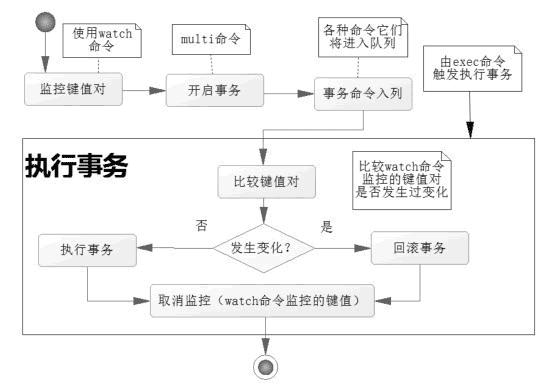
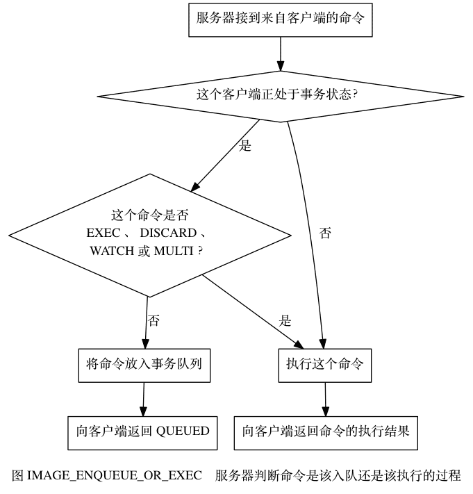

# 什么是Redis事务

Redis 事务的本质是一组命令的集合。事务支持一次执行多个命令，一个事务中所有命令都会被序列化。在事务执行过程，会按照顺序串行化执行队列中的命令，其他客户端提交的命令请求不会插入到事务执行命令序列中。

总结说：redis事务就是一次性、顺序性、排他性的执行一个队列中的一系列命令。

# Redis事务相关命令和使用

- `MULTI`：开启事务，Redis会将后续的命令逐个放入队列中，然后使用EXEC命令来原子化执行这个命令系列。
- `EXEC`：执行事务中的所有操作命令。
- `DISCARD`：取消事务，放弃执行事务块中的所有命令。
- `WATCH`：监视一个或多个key，如果事务在执行前，这个key（或多个key）被其他命令修改，则事务被中断，不会执行事务中的任何命令。
- `UNWATCH`：取消WATCH对所有key的监视。

# 事务出现错误的处理

- **语法错误（编译器错误）**：事务提交失败后，所有事务中的数据保持原值。
- **类型错误（运行时错误）**：运行时检测到错误类型，事务提交失败后，事务并没有回滚，而是跳过错误命令继续执行。

# CAS操作实现乐观锁

> WATCH命令可以为Redis事务提供check-and-set（CAS）行为。

被`WATCH`的键会被监视，并会发觉这些键是否被改动过了。如果有至少一个被监视的键在 EXEC 执行之前被修改了， 那么整个事务都会被取消，EXEC 返回nil-reply来表示事务已经失败。

如果在 WATCH 执行之后，EXEC执行之前，有其他客户端修改了 key 的值， 那么当前客户端的事务就会失败。 **程序需要做的，就是不断重试这个操作，直到没有发生碰撞为止。**

这种形式的锁被称作乐观锁，它是一种非常强大的锁机制。并且因为大多数情况下，不同的客户端会访问不同的键，碰撞的情况一般都很少，所以通常并不需要进行重试。

## watch是如何监视实现的

Redis使用WATCH命令来决定事务是继续执行还是回滚，那就需要在MULTI之前使用WATCH来监控某些键值对，然后使用MULTI命令来开启事务，执行对数据结构操作的各种命令，此时这些命令入队列。

当使用EXEC执行事务时，首先会比对WATCH所监控的键值对，如果没发生改变，它会执行事务队列中的命令，提交事务；如果发生变化，将不会执行事务中的任何命令，同时事务回滚。当然无论是否回滚，Redis都会取消执行事务前的WATCH命令。

# Redis事务执行步骤

通过上文命令执行，很显然Redis事务执行是三个阶段：

- **开启**：以MULTI开始一个事务
- **入队**：将多个命令入队到事务中，接到这些命令并不会立即执行，而是放到等待执行的事务队列里面
- **执行**：由EXEC命令触发事务

当一个客户端切换到事务状态之后， 服务器会根据这个客户端发来的不同命令执行不同的操作：

- 如果客户端发送的命令为 EXEC 、 DISCARD 、 WATCH 、 MULTI 四个命令的其中一个， 那么服务器立即执行这个命令。
- 与此相反， 如果客户端发送的命令是 EXEC 、 DISCARD 、 WATCH 、 MULTI 四个命令以外的其他命令， 那么服务器并不立即执行这个命令， 而是将这个命令放入一个事务队列里面， 然后向客户端返回 QUEUED 回复。

# 为什么Redis不支持回滚

以下是这种做法的优点：

- Redis 命令只会因为错误的语法而失败（并且这些问题不能在入队时发现），或是命令用在了错误类型的键上面：这也就是说，从实用性的角度来说，失败的命令是由编程错误造成的，而这些错误应该在开发的过程中被发现，而不应该出现在生产环境中。
- 因为不需要对回滚进行支持，所以 Redis 的内部可以保持简单且快速。

有种观点认为 Redis 处理事务的做法会产生 bug ， 然而需要注意的是， 在通常情况下， **回滚并不能解决编程错误带来的问题**。 举个例子， 如果你本来想通过 INCR 命令将键的值加上 1 ， 却不小心加上了 2 ， 又或者对错误类型的键执行了 INCR ， 回滚是没有办法处理这些情况的。

# 如何理解Redis与事务的ACID

- **原子性**：Redis使用`MULTI`/`EXEC`定义事务块，命令队列在`EXEC`时按顺序执行。若事务中的命令语法正确但逻辑错误（如对字符串执行 `HINCRBY`），Redis **不会回滚已执行的命令**。
- **一致性**：Redis不提供外键、唯一约束等机制，需由应用层保证逻辑一致性。通过`WATCH`实现乐观锁，防止事务期间数据被其他客户端修改。
- **隔离性**：Redis采用单线程处理命令，天然支持隔离性。
- **持久性**：无论是AOF还是RDB都是异步执行的，因此不保证持久性。

# 其他方式实现Redis事务

- 基于Lua脚本，Redis可以保证脚本内的命令一次性、按顺序地执行，其同时也**不提供事务运行错误的回滚**，执行过程中如果部分命令运行错误，剩下的命令还是会继续运行完
- 基于中间标记变量，通过另外的标记变量来标识事务是否执行完成，读取数据时先读取该标记变量判断是否事务执行完成。但这样会需要额外写代码实现，比较繁琐

