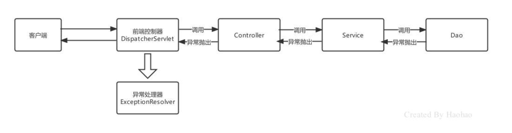

# JavaWeb基础组件

在Java语言范畴内，web层框架都是基于JavaWeb基础组件完成的，JavaWeb三大基础组件如下：

| 组件     | 作用                                         | 特点                                                         |
| -------- | -------------------------------------------- | ------------------------------------------------------------ |
| Servlet  | 服务端小程序，负责接收客户端请求并做出响应   | 单例对象，**默认第一次访问时创建**，可以通过配置指定服务器在启动时就创建，Servlet创建完毕会执行初始化init方法，每个Servlet有一个service方法，每次访问都会执行service方法，但是缺点是一个业务功能就要配置一个Servlet。 |
| Filter   | 过滤器，负责对客户端请求进行过滤操作         | 单例对象，服务器启动时就创建，对象创建完毕执行init方法，对客户端的请求进行过滤，符合要求的放行，不符合要求的直接响应客户端，执行过滤的核心方法**doFilter**。 |
| Listener | 监听器，负责对域对象的创建和属性变化进行监听 | 根据类型和作用不同，又可分为**监听域对象创建销毁**和**域对象属性内容变化**的，根据监听的域不同，又可以分为监听Request域的，监听Session域的，监听ServletContext域的。 |

# SpringMVC简介

SpringMVC是一个基于Spring开发的MVC轻量级框架，Spring3.0后发布的组件，SpringMVC和Spring可以无缝整合，使用DispatcherServlet作为前端控制器，且内部提供了处理器映射器、处理器适配器、视图解析器等组件，可以简化JavaBean封装，Json转化、文件上传等操作。

# SpringMVC的请求处理

## 请求映射路径的配置

| 相关注解        | 作用                                           | 使用位置   |
| --------------- | ---------------------------------------------- | ---------- |
| @RequestMapping | 设置控制器方法的访问资源路径，可以接受任何请求 | 方法和类上 |
| @GetMapping     | 设置控制器方法的访问资源路径，可以接受GET请求  | 方法和类上 |
| @PostMapping    | 设置控制器方法的访问资源路径，可以接受POST请求 | 方法和类上 |

`@RequestMapping`注解，主要使用在控制器的方法上，用于标识客户端访问资源路径，常用的属性有value、path、method、headers、params等。当@RequestMapping只有一个访问路径需要指定时，使用value属性、path属性或省略value和path，当有多个属性时，value和path不能省略。

## 请求数据的接受

当`@RequestMapping` 需要限定访问方式时，可以通过method属性设置：

```java
//请求地址是show，并且请求方式是POST时才能访问成功
@RequestMapping(value="/show",method=RequestMethod.POST)
public String show(){}
```

接收普通请求数据，当客户端提交的数据是普通键值对形式时，直接使用同名形参接收即可：

```
username=haohao&age=35
```

```java
@GetMapping("/show")
public String show(String username, int age){
  System.out.println(username+"=="+age);
  return "/index.jsp";
}
```

接收普通请求数据，当请求参数的名称与方法参数名不一致时，可以使用`@RequestParam`注解进行标注:

```
username=haohao&age=35
```

```java
@GetMapping("/show")
public String show(@RequestParam(name = "username",required = true) String name, int age){
  System.out.println(name+"=="+age);
  return "/index.jsp";
}
```

接收实体JavaBean属性数据，单个JavaBean数据：提交的参数名称只要与Java的属性名一致，就可以进行自动封装:

```
username=haohao&age=35&hobbies=eat&hobbies=sleep
```

```java
public class User {
  private String username;
  private Integer age;
  private String[] hobbies;
  private Date birthday;
  private Address address;
  //... 省略 get和 set方法 ...
}
```

```java
@GetMapping("/show")
public String show(User user){
  System.out.println(user);
  return "/index.jsp";
}
```

接收实体JavaBean属性数据，嵌套JavaBean数据：提交的参数名称用`.`去描述嵌套对象的属性关系即可:

```
username=haohao&address.city=tianjin&address.area=jinghai
```

```java
public class User {
  private String username;
  private Integer age;
  private String[] hobbies;
  @DateTimeFormat(pattern = "yyyy-MM-dd")
  private Date birthday;
  private Address address;
  //... 省略 get和 set方法 ...
}
```

接收数组或集合数据，客户端传递多个不同命参数时，也可以使用Map<String,Object> 进行接收，同样需要用@RequestParam 进行修饰：

```
username=haohao&age=18
```

```java
@PostMapping("/show")
public String show(@RequestParam Map<String,Object> params){
  params.forEach((key,value)->{
    System.out.println(key+"=="+value);
  });
  return "/index.jsp";
}
```

接收Json数据格式数据，Json数据都是以请求体的方式提交的，且不是原始的键值对格式的，所以我们要使用@RequestBody注解整体接收该数据。

```json
{
  "username":"haohao",
  "age":18,
  "hobbies":["eat","sleep"],
  "birthday":"1986-01-01",
  "address":{
    "city":"tj",
    "area":"binhai"
  }
}
```

```java
@PostMapping("/show6")
public String show6(@RequestBody String body){
  System.out.println(body);
  return "/index.jsp";
}
```

接收Restful风格数据，Restful请求数据一般会在URL地址上携带，可以使用注解 `@PathVariable`(占位符参数名称)

```
http://localhost/user/100
```

```java
@PostMapping("/user/{id}")
public String findUserById(@PathVariable("id") Integer id){
  System.out.println(id);
  return "/index.jsp";
}
```

请求URL资源地址包含多个参数情况

```
http://localhost/user/haohao/18
```

```java
@PostMapping("/user/{username}/{age}")
public String findUserByUsernameAndAge(@PathVariable("username") String username,@PathVariable("age") Integer age){
  System.out.println(username+"=="+age);
  return "/index.jsp";
}
```

获得转发Request域中数据，在进行资源之间转发时，有时需要将一些参数存储到request域中携带给下一个资源

```java
@GetMapping("/request1")
public String request1(HttpServletRequest request){
  //存储数据
  request.setAttribute("username","haohao");
  return "forward:/request2";
}
@GetMapping("/request2")
public String request2(@RequestAttribute("username") String username){
  System.out.println(username);
  return "/index.jsp";
}
```

## JavaWeb常用对象获取

获得Javaweb常见原生对象，有时在我们的Controller方法中需要用到Javaweb的原生对象，例如：Request、Response等，我们只需要将需要的对象以形参的形式写在方法上，SpringMVC框架在调用Controller方法时，会自动传递实参：

```java
@GetMapping("/javawebObject")
public String javawebObject(HttpServletRequest request, HttpServletResponse response, HttpSession session){
  System.out.println(request);
  System.out.println(response);
  System.out.println(session);
  return "/index.jsp";
}
```


# SpringMVC的响应处理

## 前后端分离异步业务数据响应

- 同步方式回写数据，是将数据响应给浏览器进行页面展示的，而异步方式回写数据一般是回写给Ajax引擎的，即谁访问服务器端，服务器端就将数据响应给谁。
- 同步方式回写的数据，一般就是一些无特定格式的字符串，而异步方式回写的数据大多是Json格式字符串。

当我们使用了`@RequestBody`时，直接用JavaBean就接收了Json格式的数据，原理其实就是SpringMVC底层帮我们做了转换，此处@ResponseBody也可以将JavaBean自动给我们转换成Json格式字符串回响应。

```java
@GetMapping("/response5")
@ResponseBody
public User response5() throws JsonProcessingException {
  //创建 JavaBean
  User user = new User();
  user.setUsername("haohao");
  user.setAge(18);
  //直接返回 User对象
  return user;
}
```

@ResponseBody注解使用优化，在进行前后端分离开发时，Controller的每个方法都是直接回写数据的，所以每个方法上都得写@ResponseBody，可以将@ResponseBody写到Controller上，那么该Controller中的所有方法都具备了返回响应体数据的功能了。

进一步优化，可以使用`@RestController`替代@Controller和@ResponseBody，@RestController内部具备的这两个注解的功能。

# SpringMVC拦截器

## 拦截器Interceptor简介

SpringMVC的拦截器`Interceptor`规范，主要是对Controller资源访问时进行拦截操作的技术，当然拦截后可以进行权限控制，功能增强等都是可以的。

## 拦截器快速入门

实现了`HandlerInterceptor`接口，且被Spring管理的Bean都是拦截器。接口定义如下：

```java
public interface HandlerInterceptor {
  default boolean preHandle(HttpServletRequest request, HttpServletResponse response, Object handler) throws Exception {
    return true;
  }
  
  default void postHandle(HttpServletRequest request, HttpServletResponse response, Object handler, @Nullable ModelAndView modelAndView) throws Exception {
  }
  
  default void afterCompletion(HttpServletRequest request, HttpServletResponse response, Object handler, @Nullable Exception ex) throws Exception {
  }
}
```

|                 | 作用                                                         | 参数                                                         | 返回值                                                       |
| --------------- | ------------------------------------------------------------ | ------------------------------------------------------------ | ------------------------------------------------------------ |
| preHandler      | 对拦截到的请求进行预处理，返回true放行执行处理器方法，返回false不执行 | Handler是拦截到的Controller方法处理器                        | **一旦返回false，代表终止向后执行，所有后置方法都不执行**，最终方法只执行对应的preHandler返回了true的 |
| postHandler     | 在处理器的方法执行后，对拦截到的请求进行后处理，可以在方法中对模型数据和视图进行修改 | Handler是拦截到的Controller方法处理器；modelAndView是返回的模型视图对象 | 无                                                           |
| afterCompletion | 视图渲染完成后（整个流程结束之后），进行最后的处理，如果请求流程中有异常，可以处理异常对象 | Handler是拦截到的Controller方法处理器，ex是异常对象          | 无                                                           |

编写MyInterceptor01实现HandlerInterceptor接口：

```java
public class MyInterceptor01 implements HandlerInterceptor {
  @Override
  public boolean preHandle(HttpServletRequest request, HttpServletResponse response, Object
                           handler) throws Exception {
    System.out.println("Controller方法执行之前...");
    return true;//放行
  }
  @Override
  public void postHandle(HttpServletRequest request, HttpServletResponse response, Object handler,
                         ModelAndView modelAndView) throws Exception {
    System.out.println("Controller方法执行之后...");
  }
  @Override
  public void afterCompletion(HttpServletRequest request, HttpServletResponse response, Object
                              handler, Exception ex) throws Exception {
    System.out.println("渲染视图结束，整个流程完毕...");
  }
}
```

配置Interceptor:

```xml
<!--配置拦截器-->
<mvc:interceptors>
  <mvc:interceptor>
    <!--配置对哪些资源进行拦截操作-->
    <mvc:mapping path="/*"/>
    <bean class="com.itheima.interceptor.MyInterceptor01"></bean>
  </mvc:interceptor>
</mvc:interceptors>
```

## 拦截器执行顺序

当每个拦截器都是放行状态时，三个方法的执行顺序如下：


当Interceptor1和Interceptor2处于放行，Interceptor3处于不放行时，三个方法的执行顺序如下：


**拦截器执行顺序取决于 Interceptor 的配置顺序。**

# SpringMVC异常处理机制

## SpringMVC的异常处理流程

异常分为编译时异常和运行时异常，编译时异常我们 try-cache 进行捕获，捕获后自行处理，而运行时异常是不可预期的，就需要规范编码来避免，在SpringMVC 中，不管是编译异常还是运行时异常，都可以最终由SpringMVC提供的异常处理器进行统一处理，这样就避免了随时随地捕获处理的繁琐性。

SpringMVC处理异常的思路是，一路向上抛，都抛给前端控制器DispatcherServlet，DispatcherServlet在调用异常处理器ExceptionResolver进行处理，如下图：



## SpringMVC的异常处理方式

SpringMVC 提供了以下三种处理异常的方式：

- 简单异常处理器：使用SpringMVC内置的异常处理器处理SimpleMappingExceptionResolver

  使用SimpleMappingExceptionResolver处理一些简单异常，配置开启SimpleMappingExceptionResolver，并指定异常捕获后的处理动作，当发生了异常后，会被 SimpleMappingExceptionResolver 处理，跳转到我们配置的错误页面error.html给用户进行友好展示。

- 自定义异常处理器：实现HandlerExceptionResolver接口，自定义异常进行处理

  自定义异常处理器，实现HandlerExceptionResolver接口自定义异常处理器，可以完成异常逻辑的处理。

- 注解方式：使用`@ControllerAdivce`+`@ExceptionHandler`来处理

  使用注解 @ControllerAdvice + @ExceptionHandler 配置异常，@ControllerAdvice 注解本质是一个@Component，也会被扫描到，与此同时，具备AOP功能，默认情况下对所有的Controller都进行拦截操作，拦截后干什么呢？就需要在结合@ExceptionHandler、@InitBinder、@ModelAttribute 注解一起使用了，此处我们讲解的是异常，所以是@ControllerAdvice + @ExceptionHandler的组合形式。